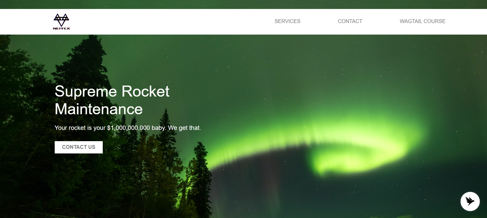
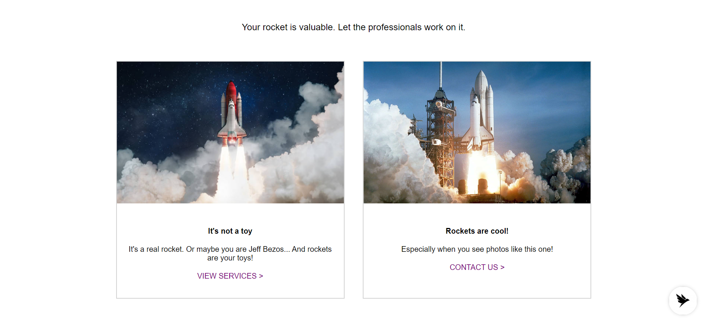
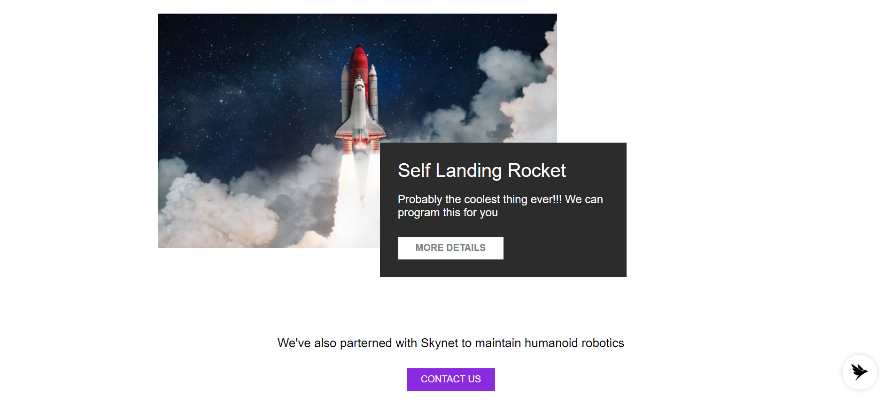
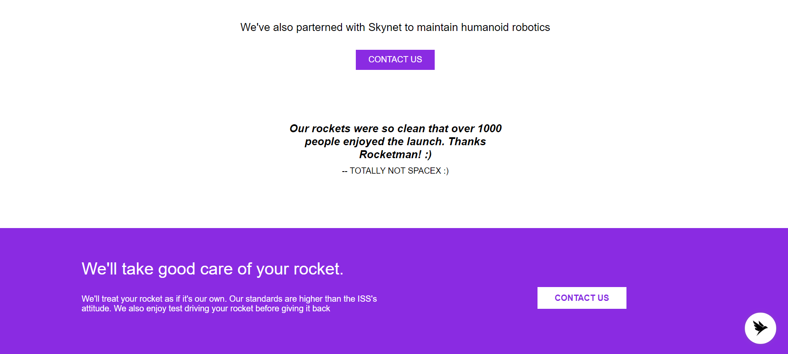
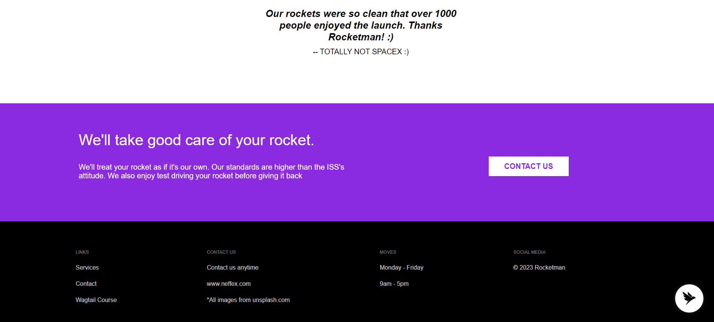

## Description

--> Created a standard website layout using JavaScript, HTML and CSS.

--> It consists of a main page with background image, a navigation bar, a title and a logo.

--> As we scroll down on the main page, there are more components like cards, images, buttons, links, footer section, etc.

--> The images used for the background image and the logo are kept in the "images" directory.

--> Some snapshots of the final UI layout are kept in the "snapshots" directory.

## Final UI Layout Images
## Snapshot1

## Snapshot2

## Snapshot3

## Snapshot4

## Snapshot5
