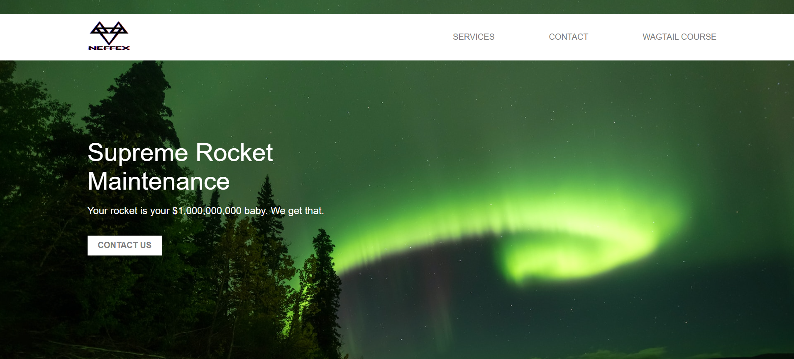

## Description

--> Created a standard website layout using JavaScript, HTML and CSS.

--> It consists of a main page with background image, a navigation bar, a title and a logo.

--> The images used for the background image and the logo are kept in the "images" directory.

--> A snapshot of the final UI is kept in the "snapshots" directory.

## Final UI Layout
